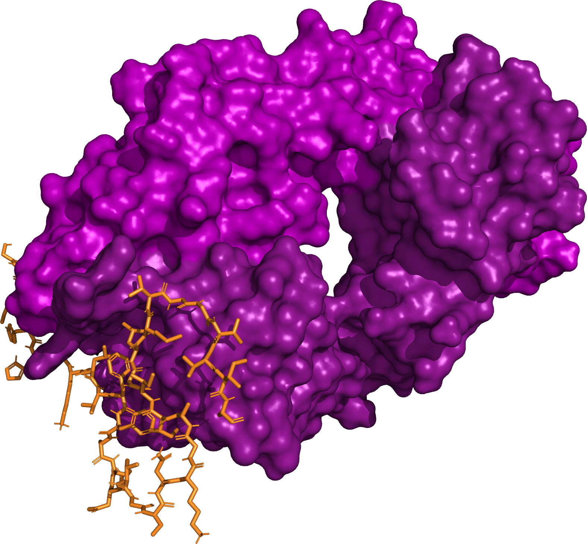

# Lecanemab Analysis

<h3 align="right">Colby T. Ford, Ph.D.</h3>

Protein interaction analysis of Lecanemab, an amyloid beta-targeting antibody used to treat Alzheimer’s Disease.

Companion repo for: https://medium.com/@colbyford/predicting-the-molecular-interactions-of-lecanemab-the-new-fda-approved-monoclonal-antibody-for-94441d6a8a24

## Structures
- Amyloid Beta 42: [structures/amyloid_beta/8azs.pdb](structures/amyloid_beta/8azs.pdb)
- Lecanemab Fab: [structures/lecanemab/lecanemab_fab.pdb](structures/lecanemab/lecanemab_fab.pdb)

## Docking Assessment

### HADDOCK Results: [docking/haddock_2.4](docking/haddock_2.4)

|          **Metric**         | **Score (+/-)** |
|:---------------------------:|:---------------:|
| HADDOCK score               | -110.7 +/- 2.9  |
| Van der Waals energy        | -93.7 +/- 0.4   |
| Electrostatic energy        | -101.2 +/- 11.7 |
| Desolvation energy          | -22.3 +/- 2.1   |
| Restraints violation energy | 256.1 +/- 29.0  |
| Buried Surface Area         | 2332.0 +/- 37.7 |

### Interacing Residues (on Fab):
- Heavy: T28, S30, S53, G54, S56, T57, and Y59
- Light: Q27 and S32

### PRODIGY Metrics

|      **Metric**     | **Value at 25℃** |
|:-------------------:|:----------------:|
| ΔG (kcal mol-1)     | -17.6            |
| Kd (M) at 25°C      | 1.20E-13         |
| Kd (M) at 37°C      | 3.80E-13         |
| ICs charged-charged | 2                |
| ICs charged-polar   | 9                |
| ICs charged-apolar  | 11               |
| ICs polar-polar     | 2                |
| ICs polar-apolar    | 49               |
| ICs apolar-apolar   | 39               |
| NIS charged         | 19.89            |
| NIS apolar          | 40.62            |
## References
- KEGG Entry: https://www.kegg.jp/entry/D11678
- DrugBank Entry: https://go.drugbank.com/drugs/DB14580
- Stern et al., 2023: https://doi.org/10.1016/j.neuron.2023.04.007
- van Dyck et al., 2023: https://www.nejm.org/doi/full/10.1056/NEJMoa2212948
- HADDOCK 2.4:
- PRODIGY: https://wenmr.science.uu.nl/prodigy/

